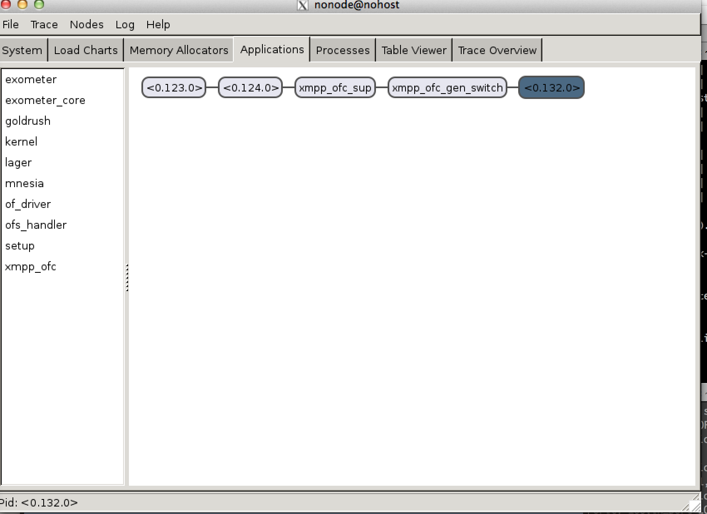
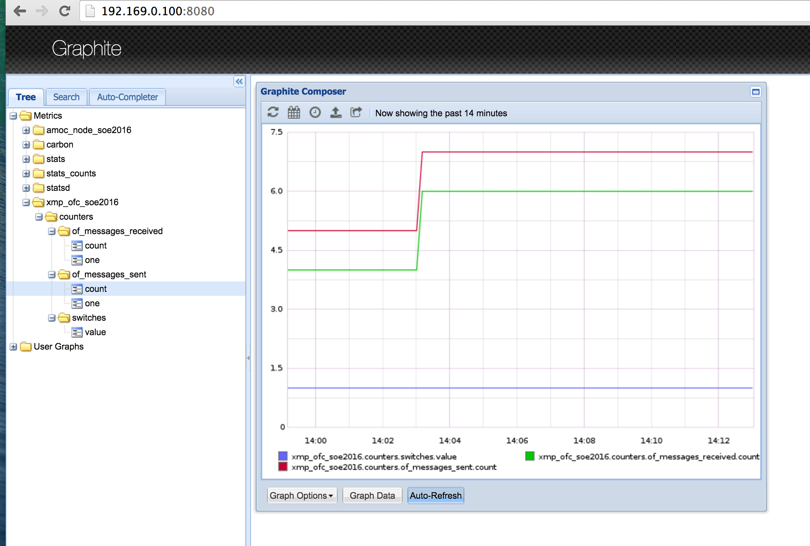

xmpp_ofc - XMPP Controller
=====

An OTP application

Build
-----

$ rebar3 compile

## References ##

#### General Erlang ####

* [Offical Erlang Documentation](http://www.erlang.org/doc/)
* [Erlang Reference Manual User's Guide](http://www.erlang.org/doc/reference_manual/users_guide.html)
* [Getting Started with Erlang User's Guide](http://www.erlang.org/doc/getting_started/users_guide.html)
* [Learn You Some Erlang](http://learnyousomeerlang.com/content)

#### OTP ####

* [gen_server behaviour](http://erlang.org/doc/design_principles/gen_server_concepts.html)
* [supervisor behaviour](http://erlang.org/doc/design_principles/sup_princ.html)
* [application behaviour](http://erlang.org/doc/design_principles/applications.html)

### OpenFlow ###

* http://flowgrammable.org/
* [OpenFlow Specifications](https://www.opennetworking.org/sdn-resources/technical-library)
  * we're interested in 1.3.x

## Architecture ##


### xmpp_ofc_gen_switch

#### API

```erlang

%% starts the process
start_link() -> {ok, pid()} 

%% called when a new switch with given DatapathId connects
open_connection(DatapathId) -> ok

%% called when a switch with given DatapathId disconnects
terminate_connection(DatapathId) -> ok.

%% called when there's a message from a switch that that some module subscribed to
handle_message(DatapathId, Msg) -> ok.
```

#### Functionalities

* Starts the modules that will implement the logic
* Keeps the runtime configuration for the switches (enabled modules, pid's under witch they run, subscriptions)
* References the LOOM libraries for handling OpenFlow messages
```erlang
subscribe(DatapathId, MsgTypes) ->
    lists:foreach(
      fun(MsgType) ->
              ofs_handler:subscribe(DatapathId,xmpp_ofc_ofsh, MsgType) 
      end, MsgTypes).

....

unsubscribe(DatapathId, MsgTypes) ->
    lists:foreach(
      fun(MsgType) ->
              case ofs_handler:unsubscribe(DatapathId, xmpp_ofc_ofsh,
                                           MsgType) of
                  ok ->
                      ok;
                  no_handler ->
                      ok
              end
              end, MsgTypes).

....
of_send(DatapathId, Messages) ->
    exometer:update(?EXO_OF_MESSAGES_SENT, 1),
    [ofs_handler:send(DatapathId, M) || M <- Messages].
```

* When a message comes from a switch it passes it to the enabled moduels based on the subcriptions:

```erlang
handle_message(MsgType, Msg, ModsConfig) ->
    exometer:update(?EXO_OF_MESSAGES_RECEIVED, 1),
    lists:foldl(fun({Mod, Pid, MsgTypes}, Acc) ->
                        case lists:member(MsgType, MsgTypes) of
                            true ->
                                Mod:handle_message(Pid, Msg, Acc);
                            false ->
                                Acc
                        end
                end, [], ModsConfig).

```

* updates metrics that are sent to graphite


### Controller Modules

#### API

```erlang
%% Starts the module and returns its pid, subscriptions, and initial OpenFlow messages that are to be sent to the contoller
start_link(DatapathId) ->  {ok, Pid, subscriptions(), init_of_messages()}

%% Stops the module
stop(Pid) -> ok

%% Called when a meesage that this module have subscribed to is received by the controller
%% Pid is the module Pid, the Msg is the message that was delivered and the OFMessages is a list of all the OpenFlow messages that are going to be sent to the controller and that were returned from the other modules.
%% This functions is epxected to return the updated list of the OpenFlow messages.
-spec handle_message(pid(),
                     {MsgType :: term(),
                      Xid :: term(),
                      MsgBody :: [tuple()]},
                     [ofp_message()]) -> [ofp_message()].
handle_message(Pid, Msg, OFMessages) -> [UpdatedOFMessage]

```

#### Description

* A controller module provides a set of functionality to be applied on the network
* It subscribtes to the messages from the switch (like packet-in)
* When a messages that it has subscribed to is recived by the controller it is passed to the Module's handle_message/4 callback which in turn adds OpenFlow messages to be sent down to the switch
* `xmpp_ofc_l2_switch` is a module implementing basic MAC-learning switch functionality
   * it subscribes to packet-in messages
   * on receiving such message it builds up a forwarding table and send appropriate Flow-Mods down to the switch
```erlang
flow_to_dst_mac(PacketIn, OutPort) ->
    [InPort, DstMac] = packet_in_extract([in_port, dst_mac], PacketIn),
    Matches = [{in_port, InPort}, {eth_dst, DstMac}],
    Instructions = [{apply_actions, [{output, OutPort, no_buffer}]}],
    FlowOpts = [{table_id, 0}, {priority, 100},
                {idle_timeout, ?FM_TIMEOUT_S(idle)},
                {idle_timeout, ?FM_TIMEOUT_S(hard)},
                {cookie, <<0,0,0,0,0,0,0,10>>},
                {cookie_mask, <<0,0,0,0,0,0,0,0>>}],
    of_msg_lib:flow_add(?OF_VER, Matches, Instructions, FlowOpts).

```

## Walthrough

This walkthrough is based on the dedicated environment [2016.04_erlang_env](https://github.com/lambdaacademy/2016.04_erlang_env). After bringing this environment up and running, log into the VM (`vagrant ssh`) and run what is described in the **Sanity Check** paragraph. You should have **Amoc*, **MongooseIM** and **OVS** running. Then follow the steps below.

### Check the swtich forwarding table

```bash
vagrant@soe2016:~$ sudo ovs-ofctl dump-flows ovs-br1 -O OpenFlow13
OFPST_FLOW reply (OF1.3) (xid=0x2):
```

The table is empty. As it was said in the aforementioned env description, OVS acts as a regular switch if it fails to connect to the controller.

### Verify the number of session in the MIM server

Connect to the server and check the number of active XMPP sessions. It should be equal to the number of **Amoc** clients:

```bash
vagrant@soe2016:~$ docker exec -it mim ./start.sh debug


IMPORTANT: we will attempt to attach an INTERACTIVE shell
to an already running ejabberd node.
If an ERROR is printed, it means the connection was not successful.
You can interact with the ejabberd node if you know how to use it.
Please be extremely cautious with your actions,
and exit immediately if you are not completely sure.

To detach this shell from ejabberd, press:
  control+c, control+c

--------------------------------------------------------------------
Press 'Enter' to continue


basename: extra operand 'tty'
Try 'basename --help' for more information.
Erlang/OTP 17 [erts-6.4] [source-2e19e2f] [64-bit] [smp:4:4] [async-threads:10] [hipe] [kernel-poll:false]

Eshell V6.4  (abort with ^G)
(mongooseim@f2f5fda4f26e)1> ets:info(session).
[{compressed,false},
 {memory,1781},
 {owner,<0.218.0>},
 {heir,none},
 {name,session},
 {size,19}, # the size indicates the number of connected clients
 {node,mongooseim@f2f5fda4f26e},
 {named_table,true},
 {type,set},
 {keypos,2},
 {protection,public}]
(mongooseim@f2f5fda4f26e)2>
```

### Clone the controller, and install it

```bash
git clone https://github.com/lambdaacademy/2016.04_erlang_xmpp_ofc
cd 2016.04_erlang_xmpp_ofc && make shell
```

After this step, the controller will be turned on and you should see it "live structure". Run observer to see the process tree:

```erlang
observer:start().
```



You can see the `xmpp_ofc_gen_switch` process and process running the module - as for now we only have the one module `xmpp_ofc_l2_switch`. By double clicking any of the processes you can see more details.

What you can also find useful, is to see the messages that are received by the controller. To achieve this we will enable tracing with the [recon](https://github.com/ferd/recon) tool:

```erlang
2> recon_trace:calls({xmpp_ofc_l2_switch, handle_message, fun(_) -> return_trace() end}, 10).
1
```

Then restart amoc so that there're new Flow Entries installed in the switch. You should see traces:

```erlang
14:3:08.308353 <0.126.0> xmpp_ofc_l2_switch:handle_message(<0.132.0>, {packet_in,0,
           [{buffer_id,no_buffer},
            {reason,action},
            {table_id,0},
            {cookie,<<0,0,0,0,0,0,0,1>>},
            {match,[{in_port,<<0,0,0,1>>}]},
            {data,<<146,118,122,99,25,71,126,180,64,7,51,39,8,0,69,0,0,60,0,
                    0,64,0,64,6,222,54,173,16,1,100,173,16,1,1,20,102,224,
                    211,82,181,48,114,244,86,73,197,160,18,113,32,80,194,0,
                    0,2,4,5,180,4,2,8,10,0,36,57,97,0,36,57,97,1,3,3,7>>}]}, [])

14:3:08.308632 <0.126.0> xmpp_ofc_l2_switch:handle_message/3 --> [{ofp_message,
                                                                   4,
                                                                   undefined,
                                                                   0,
                                                                   {ofp_flow_mod,
                                                                    <<0,0,0,0,
                                                                      0,0,0,10>>,
                                                                    <<0,0,0,0,
                                                                      0,0,0,0>>,
                                                                    0,add,10,
                                                                    0,100,
                                                                    no_buffer,
                                                                    any,any,
                                                                    [],
                                                                    {ofp_match,
                                                                     [{ofp_field,
                                                                       openflow_basic,
                                                                       in_port,
                                                                       false,
                                                                       <<0,0,0,1>>,
                                                                       undefined},
                                                                      {ofp_field,
                                                                       openflow_basic,
                                                                       eth_dst,
                                                                       false,
                                                                       <<146,118,
                                                                         122,99,
                                                                         25,71>>,
                                                                       undefined}]},
                                                                    [{ofp_instruction_apply_actions,
                                                                      2,
                                                                      [{ofp_action_output,
                                                                        16,
                                                                        4294967294,
                                                                        no_buffer}]}]}},
                                                                  {ofp_message,
                                                                   4,
                                                                   undefined,
                                                                   0,
                                                                   {ofp_packet_out,
                                                                    no_buffer,
                                                                    1,
                                                                    [{ofp_action_output,
                                                                      16,
                                                                      4294967294,
                                                                      no_buffer}],
                                                                    <<146,118,
                                                                      122,99,
                                                                      25,71,
                                                                      126,180,
                                                                      64,7,51,
                                                                      39,8,0,
                                                                      69,0,0,
                                                                      60,0,0,
                                                                      64,0,64,
                                                                      6,222,
                                                                      54,173,
                                                                      16,1,
                                                                      100,173,
                                                                      16,1,1,
                                                                      20,102,
                                                                      224,211,
                                                                      82,181,
                                                                      48,114,
                                                                      244,86,
                                                                      73,197,
                                                                      160,18,
                                                                      113,32,
                                                                      80,194,
                                                                      0,0,2,4,
                                                                      5,180,4,
                                                                      2,8,10,
                                                                      0,36,57,
                                                                      97,0,36,
                                                                      57,97,1,
                                                                      3,3,7>>}}]
```


### See the switch forwarding table

After the controller starts, the switch connects to it and the deafult Flow-Mod from the `xmmp_ofc_l2_switch` is sent. You will see it when querying the `dump-flows` ovs command:

```bash
vagrant@soe2016:~$ sudo ovs-ofctl dump-flows ovs-br1 -O OpenFlow13
OFPST_FLOW reply (OF1.3) (xid=0x2):
 cookie=0x1, duration=557.414s, table=0, n_packets=38, n_bytes=6126, priority=10 actions=CONTROLLER:65535
```

The Flow Entry above (that was created via the Flow Mod) has a priority of 10. When a packet, enters the switch, the Flow Entries are matched starting from the one with highest priority. The one that matches provides the actions to be invoked on the packet. Ohter are not tried. In our case the actions is `CONTROLLER:65535` which tells the switch to send the packet to the controller.  We can also see, that this Flow Entry already matched 38 packets (`n_packets=38`).

After a while, the `xmpp_ofc_l2_switch` installs additional Flow Entries that basically tell the switch to forward traffic between its ports. The `LOCAL` port is the `ovs-br1` switch itself (yes, switch can be treated just as port), and port 1 is the port to witch the XMPP server is attached to:

```bash
cookie=0xa, duration=281.905s, table=0, n_packets=4105, n_bytes=628898, idle_timeout=10, priority=100,in_port=LOCAL,dl_dst=7e:b4:40:07:33:27 actions=output:1
 cookie=0xa, duration=281.904s, table=0, n_packets=4046, n_bytes=760245, idle_timeout=10, priority=100,in_port=1,dl_dst=92:76:7a:63:19:47 actions=LOCAL
```

### See the stats of the controller in graphite



### Task: Simple Intrusion Detections System (Simple IDS)

The idea is to implement another module, the same way as `xmmp_ofc_l2_switch` providing a functionality of limiting the rate of messages sent by a particular client.

##### Assumptions

* Providing you work with the [2016.04_erlang_env](https://github.com/lambdaacademy/2016.04_erlang_env
), the XMPP server is always on port
* Initial Flow-Mod (`start_link/1` callback) should match on all XMPP messages and its priority should be higher than a default Flow-Mod capturing not-matched packtes
```erlang
Matches = [{eth_type, 16#0800}, {ip_proto, <<6>>}, {tcp_dst, <<5222:16>>}],
    Instructions = [{apply_actions, [{output, controller, no_buffer}]}],
    FlowOpts = [{table_id, 0}, {priority, 150},
                {idle_timeout, 0},
                {idle_timeout, 0},
                {cookie, <<0,0,0,0,0,0,0,150>>},
                {cookie_mask, <<0,0,0,0,0,0,0,0>>}],
    of_msg_lib:flow_add(?OF_VER, Matches, Instructions, FlowOpts).    
```
* This module should subscribe to *packet-in* messages and when they are delivered (`handle_message/3` callback) check whether the **packet-in** was sent by matching on the initial Flow-Mod (for example by checking the cookie that is the same in the Flow-Mod that triggered the packet-in and in the packet in itself; checking the port number should work too)
* Based on the packet in, the module should sent another Flow-Mod to allow subsequent packets of this flow
```erlang
handle_packet_in({_, Xid, PacketIn}, DatapathId, FwdTable0) ->
    [IpSrc, TCPSrc] = packet_in_extract([ip_src, tcp_src], PacketIn),
    Matches = [{eth_type, 16#0800},
               {ip_src, IpSrc},
               {ip_proto, <<6>>},
               {tcp_src, TCPSrc},
               {tcp_dst, <<5222:16>>}],
    Instructions = [{apply_actions, [{output, 1, no_buffer}]}],
    FlowOpts = [{table_id, 0}, {priority, 150},
                {idle_timeout, ?FM_TIMEOUT_S(idle)},
                {idle_timeout, ?FM_TIMEOUT_S(hard)},
                {cookie, <<0,0,0,0,0,0,0,200>>},
                {cookie_mask, <<0,0,0,0,0,0,0,0>>}],
    FM = of_msg_lib:flow_add(?OF_VER, Matches, Instructions, FlowOpts),
    PO = packet_out(Xid, PacketIn, 1),
    {[FM, PO], FwdTable0}.
```
* This module should regulary check the statistics of this Flow-Mod and compute whether a particualr threshold was exceeded (for example let's say we allow only 100 packets/min). If the limit is reached the module should sent blocking Flow-Mod (the drop action):
```erlang
handle_packet_in({_, Xid, PacketIn}, DatapathId, FwdTable0) ->
    [IpSrc, TCPSrc] = packet_in_extract([ip_src, tcp_src], PacketIn),
    Matches = [{eth_type, 16#0800},
               {ip_src, IpSrc},
               {ip_proto, <<6>>},
               {tcp_src, TCPSrc},
               {tcp_dst, <<5222:16>>}],
    Instructions = [{apply_actions, [drop]}],
    FlowOpts = [{table_id, 0}, {priority, 150},
                {idle_timeout, ?FM_TIMEOUT_S(idle)},
                {idle_timeout, ?FM_TIMEOUT_S(hard)},
                {cookie, <<0,0,0,0,0,0,0,200>>},
                {cookie_mask, <<0,0,0,0,0,0,0,0>>}],
    FM = of_msg_lib:flow_add(?OF_VER, Matches, Instructions, FlowOpts),
    PO = packet_out(Xid, PacketIn, 1),
    {[FM, PO], FwdTable0}.
```
